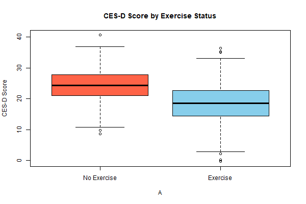

## Impact of Model Misspecification on Causal Effect Estimation: A Simulation Using Super Learner and Generalized Linear Models

# Acknowledgment

This project replicates the simulation study from: Schuler MS, Rose S.
Targeted Maximum Likelihood Estimation for Causal Inference in
Observational Studies. Am J Epidemiol. 2017;185(1):65–73.
<https://doi.org/10.1093/aje/kww165>

This work is for educational and research purposes only and does not
claim ownership of the original design or methods.

TMLE can be used to estimate the ATE, a common epidemiologic estimand. A
primary advantage of TMLE is that it is inherently a doubly robust
estimator. Neither G-computation nor propensity score methods as
commonly implemented (e.g., IPW) are doubly robust, although other
doubly robust methods exist (28–30). TMLE’s double robustness ensures
unbiasedness of the ATE if either the exposure or the out- come
mechanism is consistently estimated. As highlighted in our simulation,
this property insulates TMLE even against significant model
misspecification arising from an omitted confounder in either the
exposure or outcome regressions. In contrast, our results demonstrated
that misspecification arising from an omitted variable resulted in large
bias for both G-computation and IPW.

Fundamentally, TMLE and the other estimators discussed can be
implemented using machine learning algorithms, which can prove
advantageous in complex observational data. As our simulation results
demonstrate, super learning performedbetter than or equal to parametric
regression for all 3 estimators. The ability of super learning to
protect against certain types of functional form misspecification is
demonstrated by the G-computation results, as super learning yielded
smaller bias than parametric regression with only main terms. Given the
complexity of data in typical observational studies, correct
specification of all parametric regressions is unlikely, yet bias can
arise from even minor functional form misspecification. Machine learning
algorithms, particularly ensemble methods such as super learning, can
empirically identify interaction, nonlinear, and higher-order
relationships among variables; therefore, the corresponding ATE estimate
is less likely to be biased due to a misspecified functional form in
comparison with main-terms parametric regression. Additionally, while

TMLE with super learning and parametric regression performed
equivalently in our simulation study, TMLE with super learning may
outperform parametric regression in cases of more complex data

## Data-Generating Process

We simulate observational data with the following structure:

-   `X1`: Gender (binary; 55% probability of being 1)
-   `X2`: Therapy use (binary; 30% probability)
-   `X3`: Antidepressant use (binary; 25% probability)
-   `A`: Regular physical exercise (binary exposure, depends on
    covariates)
-   `Y`: CES-D depression score (continuous outcome, depends on A and
    covariates)

<!-- -->

    # Load required libraries
    set.seed(123)  # For reproducibility
    N <- 1000      # Sample size

    # Covariates
    X1 <- rbinom(N, 1, prob = 0.55)  # Gender
    X2 <- rbinom(N, 1, prob = 0.30)  # Therapy
    X3 <- rbinom(N, 1, prob = 0.25)  # Antidepressant use

    # Exposure: Regular physical exercise
    A <- rbinom(N, 1, plogis(-0.5 + 0.75*X1 + 1*X2 + 1.5*X3))

    # Outcome: CES-D score
    Y <- 24 - 3*A + 3*X1 - 4*X2 - 6*X3 - 1.5*A*X3 + rnorm(N, mean = 0, sd = 4.5)

    # Combine into a data.frame
    data <- data.frame(X1, X2, X3, A, Y)

## True Average Treatment Effect (ATE)

We define the Average Treatment Effect (ATE) as the expected difference
in potential outcomes:

ATE = 𝔼\[*Y*(1) − *Y*(0)\]

From the data-generating model:

*Y* = 24 − 3*A* + 3*X*1 − 4*X*2 − 6*X*3 − 1.5*A**X*3 + *ε*

The conditional treatment effect is:

*Y*(1) − *Y*(0) = −3 − 1.5*X*3

Taking the expectation over *X*3 ∼ Bernoulli(0.25):

$$
\text{ATE} = \mathbb{E}\[-3 - 1.5X\_3\] = -3 - 1.5 \cdot \mathbb{E}\[X\_3\] = -3 - 1.5 \cdot 0.25 = \boxed{-3.375}
$$

    png("cesd_plot.png", width = 600, height = 400)
    boxplot(Y ~ A, data = data,
            main = "CES-D Score by Exercise Status",
            names = c("No Exercise", "Exercise"),
            col = c("tomato", "skyblue"),
            ylab = "CES-D Score")
    dev.off()

    ## png 
    ##   2

<figure>

<figcaption aria-hidden="true">CES-D Plot</figcaption>
</figure>

# Results

Our simulation study demonstrates all methods using super learning,
highlighting that incorporation of machine learning may outperform
parametric regression in observational data settings.

<table>
<caption>Estimated ATEs with SEs and 95% Confidence Intervals</caption>
<thead>
<tr class="header">
<th style="text-align: left;"></th>
<th style="text-align: left;">Method</th>
<th style="text-align: right;">Estimate</th>
<th style="text-align: right;">SE</th>
<th style="text-align: right;">Lower</th>
<th style="text-align: right;">Upper</th>
<th style="text-align: right;">Bias</th>
</tr>
</thead>
<tbody>
<tr class="odd">
<td style="text-align: left;">tmle.SL1</td>
<td style="text-align: left;">TMLE SL</td>
<td style="text-align: right;">-3.326</td>
<td style="text-align: right;">1.065</td>
<td style="text-align: right;">-5.007</td>
<td style="text-align: right;">-1.241</td>
<td style="text-align: right;">-0.049</td>
</tr>
<tr class="even">
<td style="text-align: left;">tmle.GLM1</td>
<td style="text-align: left;">TMLE GLM1</td>
<td style="text-align: right;">-3.291</td>
<td style="text-align: right;">1.104</td>
<td style="text-align: right;">-5.017</td>
<td style="text-align: right;">-1.193</td>
<td style="text-align: right;">-0.084</td>
</tr>
<tr class="odd">
<td style="text-align: left;">tmle.GLM2</td>
<td style="text-align: left;">TMLE GLM2</td>
<td style="text-align: right;">-3.472</td>
<td style="text-align: right;">1.107</td>
<td style="text-align: right;">-5.453</td>
<td style="text-align: right;">-1.417</td>
<td style="text-align: right;">0.097</td>
</tr>
<tr class="even">
<td style="text-align: left;">tmle.GLM3</td>
<td style="text-align: left;">TMLE GLM3</td>
<td style="text-align: right;">-3.332</td>
<td style="text-align: right;">1.085</td>
<td style="text-align: right;">-5.170</td>
<td style="text-align: right;">-1.384</td>
<td style="text-align: right;">-0.043</td>
</tr>
<tr class="odd">
<td style="text-align: left;">mle.SL1</td>
<td style="text-align: left;">GComp SL</td>
<td style="text-align: right;">-3.134</td>
<td style="text-align: right;">0.987</td>
<td style="text-align: right;">-5.063</td>
<td style="text-align: right;">-1.323</td>
<td style="text-align: right;">-0.241</td>
</tr>
<tr class="even">
<td style="text-align: left;">mle.GLM1</td>
<td style="text-align: left;">GComp GLM1</td>
<td style="text-align: right;">-3.252</td>
<td style="text-align: right;">1.035</td>
<td style="text-align: right;">-5.168</td>
<td style="text-align: right;">-1.293</td>
<td style="text-align: right;">-0.123</td>
</tr>
<tr class="odd">
<td style="text-align: left;">mle.GLM2</td>
<td style="text-align: left;">GComp GLM2</td>
<td style="text-align: right;">-5.004</td>
<td style="text-align: right;">1.194</td>
<td style="text-align: right;">-7.502</td>
<td style="text-align: right;">-2.568</td>
<td style="text-align: right;">1.629</td>
</tr>
<tr class="even">
<td style="text-align: left;">psw.SL1</td>
<td style="text-align: left;">IPW SL</td>
<td style="text-align: right;">-3.615</td>
<td style="text-align: right;">1.083</td>
<td style="text-align: right;">-5.460</td>
<td style="text-align: right;">-1.487</td>
<td style="text-align: right;">0.240</td>
</tr>
<tr class="odd">
<td style="text-align: left;">psw.GLM2</td>
<td style="text-align: left;">IPW GLM2</td>
<td style="text-align: right;">-4.990</td>
<td style="text-align: right;">1.210</td>
<td style="text-align: right;">-7.418</td>
<td style="text-align: right;">-2.537</td>
<td style="text-align: right;">1.615</td>
</tr>
</tbody>
</table>

Estimated ATEs with SEs and 95% Confidence Intervals
